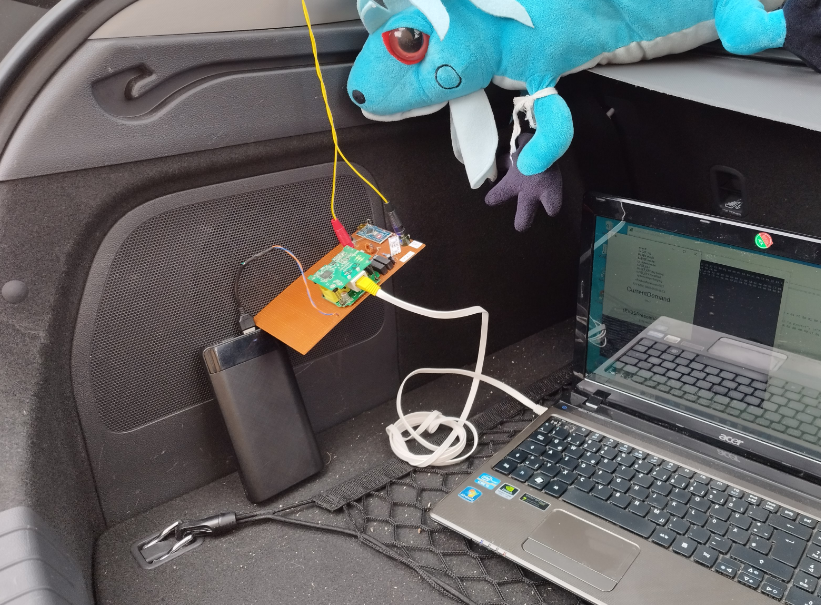

# EvseMode

This document describes how to use the pyPlc project as a charging station. The possible use cases are to really charge a car via CCS (which requires a lot of additional power-electric hardware), or to investigate whether it is possible to draw energy out of the cars CCS port.

Discussion here: https://openinverter.org/forum/viewtopic.php?t=3551

## Hardware

To convince the car, that a CCS charger is connected, several preconditions need to be fulfilled:
* PP resistor: Between the ProximityPilot and PE (Ground) we must connect 1.5kOhms resistor.
* CP signalling: The ControlPilot needs to be pulled to 12V over 1kOhms. If the car pulls the CP down to 9V, we must provide a PWM with 1kHz, 5% width, plus and minus 12V amplitude via 1kOhm resistor. Basically the CP signalling is the same as in a standard AC wallbox, the only difference is the fix 5% PWM ratio. As wallbox controller I used an arduino, similar to https://www.instructables.com/Arduino-EV-J1772-Charging-Station with the software https://github.com/uhi22/WallboxArduino, and the poti on left border to select 5% PWM.
* Homeplug communication: The car wants to establish high-level communication on the CP line, using the HomePlug standard. We connect a modified homeplug modem between the CP and PE, with coupling network e.g. 150 ohms and 1nF in series, to not disturb the 1kHz PWM too much. The modification of the modem is shown in [Hardware manual](hardware.md)
* On the ethernet port of the HomePlug modem we connect a computer which handles the high level communication. This may be a Windows10 laptop or a Raspberry or similar.
* We need a power supply for the HomePlug modem and the Arduino-charging-logic, e.g. an USB power bank.

## Software

### Configuring the HomePlug modem as Charging Station

The homeplug modem needs a special configuration, to support the features which are needed for a charging station. We need to write a special configuration file to it. This is necessary only once, the modem will store the settings non-volatile.
Details in readme.md chapter "Configuration of the PLC adaptor"

### Installing pyPlc and openV2Gx on the computer
See [Raspberry installation manual](installation_on_raspberry.md) or 
[Windows installation manual](installation_on_windows.md)

## First run into charging loop
Notebook is connected via Ethernet cable to the homeplug modem. The homeplug modem and the arduino-charging-logic is supplied by an USB power bank. The PE from the car is connected to ground of the homeplug modem and ground of the arduino-charging-logic. The CP of the vehicle is connected to the hot side of the homeplug modem and the hot side of the arduino-charging-logic. The PP of the car is connected to PE via 1k5 (inside the plug).
On the laptop, just run `python pyPlc.py E`.

